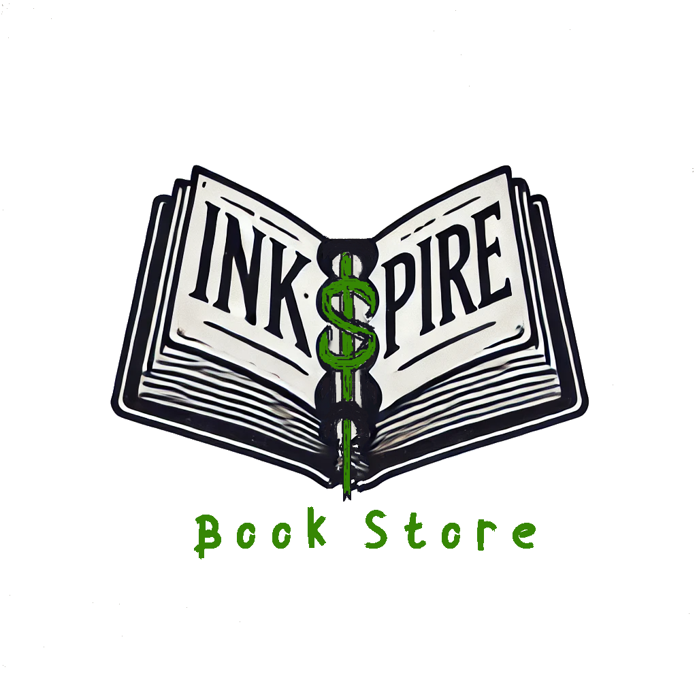

# InkSpire

## Overview

**InkSpire** is an e-commerce web application tailored for book lovers. The platform allows users to browse, buy, and manage books while exploring features like advanced search, favorites, reviews, and secure PayPal payments. Admins have dedicated tools for managing book listings and user requests, creating a dynamic and interactive online bookstore experience.

## Project Idea

**InkSpire** was inspired by the need for a specialized book marketplace that goes beyond simple purchasing. Users can engage more deeply with their collections through favorites, reviews, and personalized selections. The application incorporates tools like PayPal for seamless transactions and user authentication for secure access, delivering a comprehensive platform for book enthusiasts.

## Features

- **Browse and Search Books**: Search by categories, authors, or keywords for quick and intuitive exploration.
- **User Authentication**: Secure sign-up and login options, including Google authentication for easy access.
- **Favorites and Reviews**: Save books to favorites and leave reviews to contribute to the book community.
- **Book Requests**: Users can request to add their own books for sale, subject to admin review and approval.
- **Admin Panel**: Manage books, user requests, and sales with a full-featured admin dashboard.
- **Shopping Cart and Orders**: Easily add books to a shopping cart, review orders, and manage purchases.
- **Payment Integration**: Streamlined and secure payment processing with PayPal.

## API Documentation

Explore the complete API documentation for InkSpire on [SwaggerHub](https://app.swaggerhub.com/apis-docs/MOSTAFA51MOKTAR/ink-spire_book_store_api/1.0.0).

## Authors

### Back-End Developers
- **Mostafa Mokhtar** - [mostafa51moktar@gmail.com](mailto:mostafa51moktar@gmail.com)
- **Mostafa Abokhadra** - [mbukhadra@gmail.com](mailto:mbukhadra@gmail.com)

### Front-End Developers
- **Momen Sameh** - [momensameh5@gmail.com](mailto:momensameh5@gmail.com)
- **Abdullah Osama** - [abdullahosama.aoao@gmail.com](mailto:abdullahosama.aoao@gmail.com)

## License

This project is licensed under the MIT License. See the LICENSE file for more details.

## Use Case Architecture

The following diagram illustrates the various roles and interactions within the **InkSpire** web application. Each actor's responsibilities and control over website features are outlined to enhance user experience and functionality.

## Acknowledgements

This project was developed as part of the ALX Software Engineering program's graduation portfolio. Special thanks to the ALX instructors and mentors for their invaluable support and guidance.
